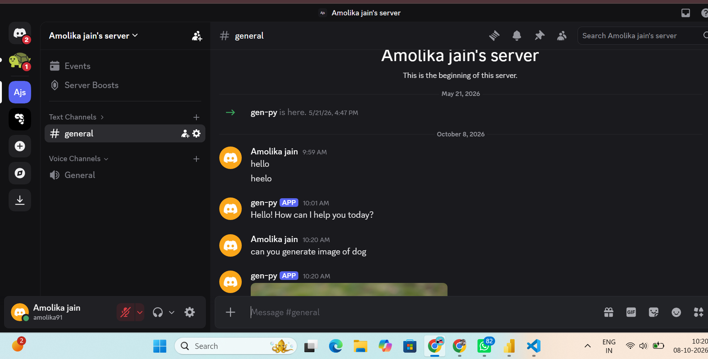
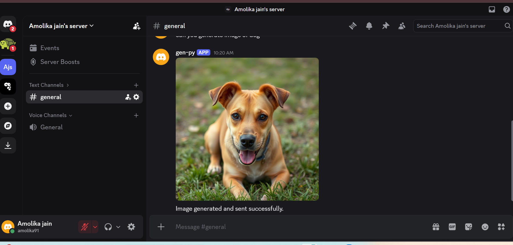

# 🤖 Discord AI Assistant

An AI-powered Discord assistant built using Python, Discord.py, LangChain, Google Gemini, and Tavily.

## ✨ Features

- 💬 AI-powered conversations
- 🧠 LangChain AI agent
- 🔎 Web search
- 🖼️ AI image generation
- 💻 Discord integration
- 🔐 Secure API key configuration

## 🛠️ Tech Stack

- Python
- Discord.py
- LangChain
- LangGraph
- Google Gemini
- Tavily
- Pollinations AI

## 📸 Screenshots

### 💬 Discord AI Chat



### 🖼️ AI Image Generation



## 🚀 Setup

### 1. Clone the repository

```bash
git clone https://github.com/Amolikajain/DiscordassistantAI.git
cd DiscordassistantAI